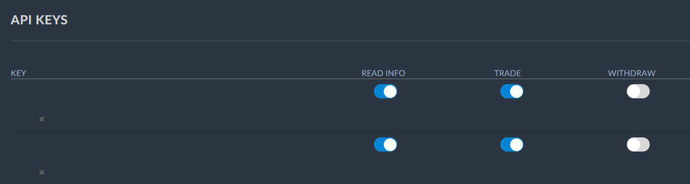

# Creating API keys

To use Gunbot you need to create an API key at your exchange.

Through the API Gunbot can connect to the exchange and trade on your behalf. Gunbot uses the exchange assigned API key as license key to prevent fraud.

On most exchanges you can find the option to create API keys on their account or settings page.

This page shows the minimum required settings per exchange to create a working API key.

## Binance

## Binance Futures

## Bitfinex

## Bitmex

## Bittrex

## CEX

## Coinbase Pro

## Huobi

## Kraken

## Kucoin

## Poloniex

